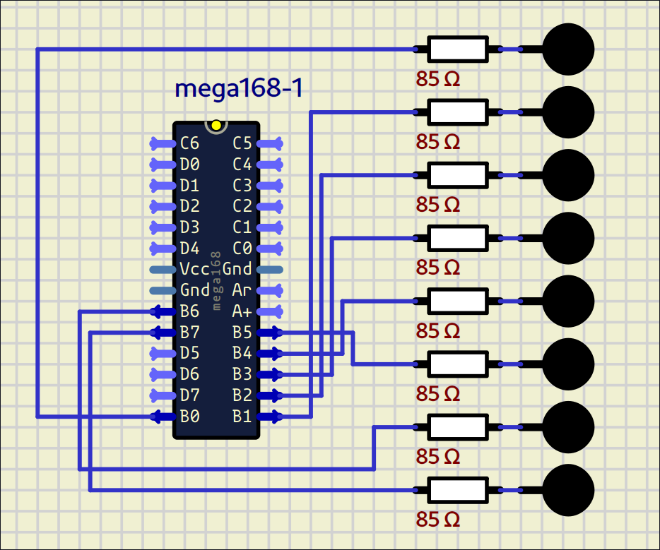

# Software PWM for Dual LED Control with ATmega168 (Timer0)

This project implements PWM (Pulse Width Modulation) brightness control for two groups of LEDs (4 bits each) using an ATmega168 microcontroller. It uses **Timer0** in normal mode with comparators A and B to generate two independent PWM signals without requiring dedicated hardware PWM channels.

## 📷 Demonstration



## 🚀 Features

- Independent brightness control for two banks of 4 LEDs.
- Fixed PWM frequency adjustable via Timer0 prescaler.
- Brightness sweeping: one bank increases brightness while the other decreases (cross-fade effect).
- Fully software-based implementation using Timer0 interrupts.
- Low overhead in the main loop.

## 🧠 How It Works

The code simulates two 8-bit PWM signals as follows:

- **TIMER0_OVF**: When the timer overflows, all LEDs turn ON.
- **TIMER0_COMPA**: When the counter reaches `brightnessA`, bank A turns OFF (higher nibble).
- **TIMER0_COMPB**: When the counter reaches `brightnessB`, bank B turns OFF (lower nibble).

Thus, the effective duty cycle for each bank is proportional to `brightnessX / 255`.

## 🛠️ Project Structure

```
.
├── LICENSE
├── Makefile
├── PWM.png
└── src/
    ├── includes/
    │   ├── CPU.h
    │   └── pinDefines.h
    └── main.c
```

### Key Files

- **main.c**: Main logic, Timer0 initialization, and ISRs.
- **pinDefines.h**: Pin definitions (LED_DDR, LED_PORT, etc.).
- **CPU.h**: MCU-specific configurations (registers, types, etc.).
- **Makefile**: Build and flash configuration (adjust for your programmer and MCU).

## ⚙️ Hardware Configuration

| Bank | Pins on LED_PORT | Action on COMPA/COMPB |
|------|------------------|------------------------|
| A    | Bits 4..7        | Turns OFF on COMPA     |
| B    | Bits 0..3        | Turns OFF on COMPB     |

> 🔌 Connect LEDs with current-limiting resistors to the corresponding port pins. The cathodes should go to ground.

## 🔧 Compilation and Programming

### Requirements

- AVR-GCC toolchain
- Make
- Programmer (AVRISP, USBasp, Arduino as ISP, etc.)

### Build

```bash
make
```

### Flash

```bash
make flash
```

### Clean

```bash
make clean
```

## ⏱️ Adjustable Parameters

| Parameter     | Value | Description                                  |
|---------------|-------|----------------------------------------------|
| `DELAY_ms`    | 3     | Step delay between brightness changes (ms)  |
| Prescaler     | 64    | Configured via CS01 and CS00 on Timer0      |
| Resolution    | 8-bit | 0 to 255 brightness levels                   |

## 📝 Implementation Notes

- Interrupts are enabled with `sei()`.
- `brightnessA` and `brightnessB` values are modified in the main loop and used inside ISRs.
- The main loop is only blocked by `_delay_ms` (does not affect PWM generation).
- This code is fully compatible with ATmega168 (same Timer0 registers as ATmega328P).

## Microcontroller's DataSheet

[Click Here](https://html.alldatasheet.com/html-pdf/83753/ATMEL/ATMEGA168/6379/48/ATMEGA168.html)

---

## 📄 License

This project is distributed under the license found in the `LICENSE` file.